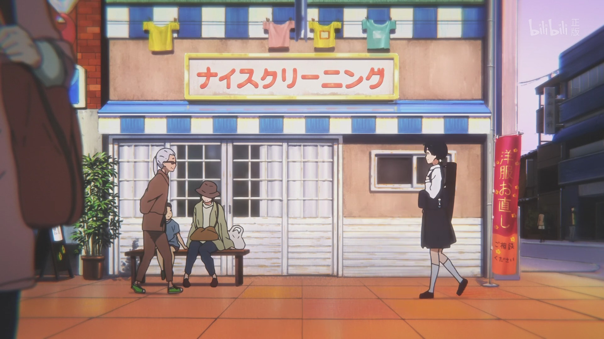
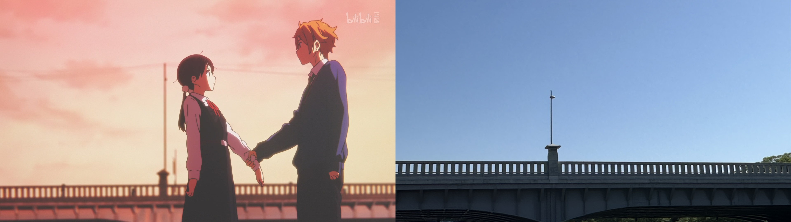

## 前言

aaaa

## 正文

### 藤森駅

本次「玉子爱情故事」圣地巡礼的第一站位于京都市伏见区的藤森駅。

因为就在我在京都的住所就在这附近，大概步行了10分钟就到了，出站口就能看到阶梯以及这座小桥，这里的人流不是很多，周围就是很平常的住宅区。动画的开头部分玉子、神奈、小绿以及Shiori就是在这座桥上聊起了未来的去向和打算，也是为剧场版讲述「对成长与未知前路的迷茫」的主题之一进行铺垫。

ps. 角度构图算是已经尽可能还原了，包括两侧的房屋、天空等。

### 出町桝形商店街

动画在简单的开头引入后进入以玉子为主视角的玉子市场的描写，也即现实中的出町桝形商店街。

这里也是我非常喜欢的镜头。玉子和同伴们在商店街门口道别，随即流露出了稍显落寞的表情，同伴们都有自己的目标，而自己却什么也没有考虑。

摄像机随着玉子的脚步踏入商店街，本是有些阴暗的黄昏时分一下子变得温暖明亮起来。商店街就像是一个和外界隔绝的世外桃源，可以暂时忘却「长大」「未来」这些让人不愿去面对的事情，无论是互相招呼问候的花店店长，还是亲切待人的可乐饼店老板，这里的一切都让人感到舒适美好。

从小就在这样温暖的邻里环境里成长，被他人所爱着的玉子，也自然地能温柔地去看待这个世界，去爱着这个世界上的其他人。在原作的塑造里，玉子总是元气乐观的样子，最大的烦恼也是关于年糕之类的生活琐事，被身边的所有人喜欢，这样的性格有些太「理想」了。但实际上在如此环境里成长的孩子，这并不让人意外。从他人那里感受爱，再将这份爱传递给身边的其他人，这大概也是山田尚子老师想要传达的东西之一吧。

回到正文，虽然距离玉子市场放送已经过去很多年了，不过现实里的商店街布局其实没怎么变。咖啡店、花店、打折促销的服装店，不过鱼店关门了还是让人感到有一丝寂寞。

我几个月前碰巧路过地时候商店街还装饰着彩带，棚顶也挂着「玉子市场」和「玉子爱情故事」故事的海报。再次来到这里已经没什么动画元素了，只在某家店铺门摆放着玉子市场的大图。

.jpg>)

正如前文所讲这次其实是我第三次来玉子市场了，前番只是顺路经过，并没有正式做巡礼，这次比以往更加仔细地观察商店街的样子，才发现这里真的很「传统」，没有时尚包装的广告牌，也没有太多能吸引年轻人驻足的时尚店铺，就是很普通的街坊邻居下班放学会来逛逛顺便买点日用品的非常普通甚至有些「落后」的商店街，和那些已经被营销成观光景点的商店街很不一样。

「玉子市场」动画里屡次提到对振兴商店街，跟上时代潮流包括情人节推出新品装饰街道等，其实和现实还挺像的。三次元里的出町桝形商店街和京都市中心的许多商店街氛围大不相同，没有说这异域语言的外国人，没有身着和服极道服的观光客，也没有喧嚷嬉闹的JK，和玉子市场很像。有些店关门了，有些店铺的装修已经有些年份了，动画里多次探讨的「新兴潮流」对「传统」的冲击放在现实里也很合适。

商店街的入口处有一个小板凳，上面放着历年来巡礼的人们的留言，本子足有二十余册，记录着日本以及海外的人们对于这部动画的喜爱，每天都有喜欢同一部动画的人来到这里，本子上的日期几乎从未断过。粗略翻看几本，中文占比很高，英文和韩文也不少，当然还有不会缺席的大佬们的手绘。

.jpg>)

.jpg>)

我自己也随便留了言，因为没有写字的地方还坐到了拐角处咖啡厅外面的等待区，被店员小姐姐误以为是顾客招呼我进去。不过当天是吃了饭去的，接下来还要赶去别的地方，只好尴尬地招了招手，然后回到原来本子的放置地点，站着把留言写了。

.jpg>)

### 鴨川

出了商店街，过到马路对面就是本片的高潮表白圣地——「鸭川三角洲」了。

动画里在小绿的助攻下，饼哥终于鼓起勇气向这个从小就在自己身边却一直没有机会倾诉心意的青梅竹马传达自己的感情。饼藏和玉子并排坐在鸭川河旁的阶梯上，饼藏看着身旁的女孩一时陷入了沉默。而玉子则似乎是察觉到了什么，开始滔滔不绝地讲起もち年糕的事情。

两人聊着聊着走到了鸭川河中央，饼藏再次看向这个自己一直以来喜欢的女孩，不禁抓住了她的手，将自己内心的想法，要去东京读大学的目标都一并说出，当然也包括那句迟到了很多年的「我喜欢你」

这天鸭川河上人很多，两边的草坪上人流来来往往，也有专门来这搭着帐篷休闲野营和结伴作乐的学生们，大概是什么社团的团建吧。在我拍照的近处桥墩下，还有专程前往此处练习吹奏小号的高中生，曲子我都很熟悉，其中还有名侦探柯南的主题曲。

当然也不得不说，因为人实在是太多，找不到没人的Timing，拍照的效果其实不是很好。除却上面的几张照片，还有很多没有发出来的。虽说现实里家长陪着孩子在鸭川河里玩水，草坪上还有三三两两乘凉的老人，这样的景色也是很美好的，不过作为圣地巡礼来说，尤其是这个只有两个人的表白场景来说，实在是有些煞风景了，因此就不全部发了。

离开鸭川旁边的桥上也有一个打卡的场景，是我们非常可爱的馅子妹妹。动画里的剧情应该是馅子遇到了表白后久久没有得到答复心情失落的饼藏，随即饼藏冲向鸭川，大喊释放心中的烦躁。

.jpg>)

### 京都駅

最后的巡礼地点就是京都站了。

虽然来过京都站很多次了，但是在这个综合了购物区地铁站新干线等的复合駅里还是经常找不到路（

玉子误以为饼藏要就这样没有告别地去东京了，慌忙地跑到了京都站内。

这里有个有意思的点——玉子市场的所在地其实并不偏，即使说不上市中心，也绝对不是什么郊区位置，但是玉子在京都站里手足无措左顾右盼的表现以及玉子市场里的塑造，都很像一个刚进城的乡下土妹子，尤其是上面这张拿着土电话的样子和周围的现代设施的对比更是加深了这种印象。

本季度的Girls Band Cry的Ep1故乡是熊本的仁菜也是初来东京，却也没有像家住京都市内的玉子这样。当然不管是刻意回避手机等现代元素，还是对玉子在京都站内慌忙的表情动作展现都是情节上的有意为之，也正因如此，这个故事才显得更加浪漫。

然后是站内闸机的图片

最后一幕在站台的表白，玉子通过土电话传达感情的场景我很喜欢，不过自然是没法巡礼的，没买票不可能进去的吧www，这里就放一张原图假装去过了，等我之后有机会坐去京都的新干线再进去补上。

.jpg>)

## 写在最后

长篇累牍，都是一些无聊的碎碎念，感谢每个读到这里的你。

目前笔者住在京都市，趁着还在这里，大概会把大部分关西圈的圣地巡礼都做一遍（主要就是京阿尼的作品了），之前的「京吹」以及部分Galgame也会陆陆续续整理成文章发上来。

最后简单分享一下玉子的上学与放学路线（Google地图没弄明白路线怎么做，直接截图了w
从商店街出发，也就是图中的Demachi Futaba，步行跨过两座桥两座桥来到右边的出町柳地铁站，搭乘25min的地铁到达下面的藤森站，出站后跨过一开始的那座小桥，步行400m左右到学校。

这么一看通学时间还是挺长的，玉子还要早起帮忙做年糕，其实还挺辛苦的。

X]K8(GLK8I8RY1F.png>)