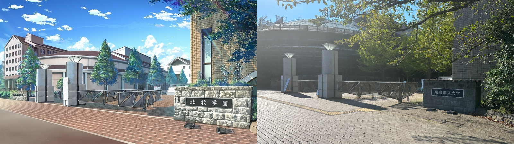
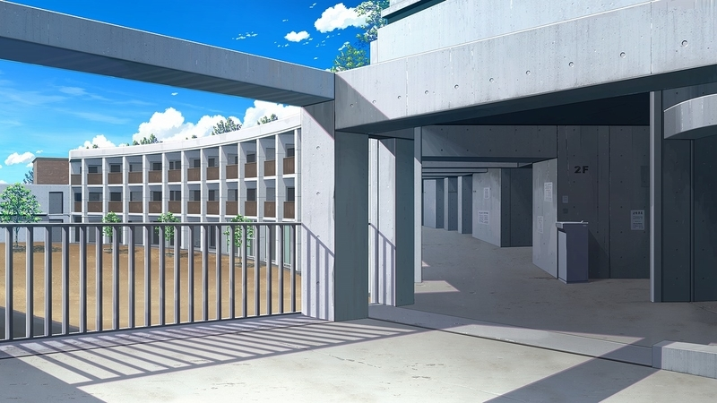
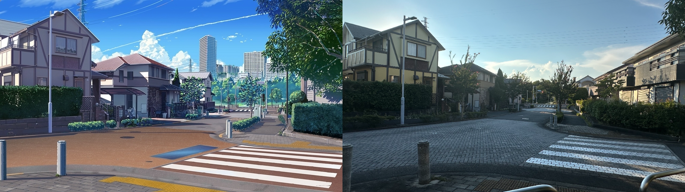
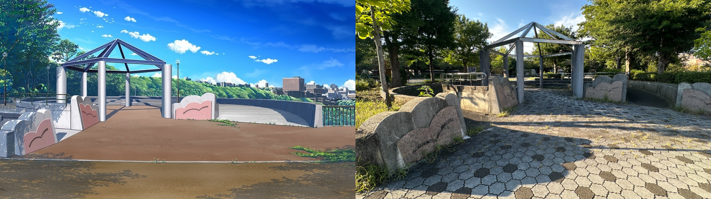

## 正文

### 南大沢駅

东京都八王子市的南大沢駅，感觉可以说是东京比较郊区的地段了，从东京市中心坐JR到这里要花一个多小时。

### 东京都立大学

南大沢駅附近和日本其他环绕电车站而建的商业街一样，也是个适合周末出来放松的购物区，咖啡店服装店什么的都有很多。走过商业街的天桥就到了东京都立大学，游戏中北牧学園的原型。

我大学院考试其实本来准备用东京都立大学保底的，不过招收似乎特别偏向内部生的样子，于是只能作罢。话说回来校园真的挺美的，设施也很新完全不像是个公立学校，绿化做得非常不错，和学校前面欧式风格的建筑相映衬，走在校园里感觉很惬意。

游戏里以东京都立大学为原型可以巡礼的地方除了这张校园门口的照片外，还有男主所在科学部（？）对应的社团活动中心。巡礼当日虽是周六，但这里还是人声鼎沸，似是排球棒球部在准备练习。走到社团楼的门口，里面的人一齐转头向我看来，考虑到我这个校外人员进去就为了拍张照片多少有些不便，这里就只放张游戏内的Cg。

### 別所一丁目

大概是男主上学和去新田忍家的餐厅吃饭会经过的路口（？）现实里就是一个住宅区，不过这建筑风格我还挺喜欢的。

### 別所ふれあい公園

### 小笠原村
在距离东京几百公里的地方，去的话肯定得两天以上了，所以很遗憾这次没机会巡礼了，之后有机会去的话再补上吧，这里先占个位。

## 关于游戏与新岛夕的一点感想

本来应该到这结束，不过这篇文章巡礼内容确实有些太少了，为了不让文章看起来太短太水，还是随便扯一点我推本作时的感想以及游戏相关的闲聊吧，想到哪里写到哪里就不留意措辞了。

4年前的2021年本作『アインシュタインより愛を込めて』发售，在推罢由新岛夕企划主笔个人风格强烈的『恋×シンアイ彼女』以及『魔女恋爱日记』后，彼时的我俨然一新岛孝子，自是对这个时隔近五年的新作充满了期待。虽然本作最后的评价并不高，甚至通过Fd补全剧情也没能完全扭转风评，但于我本人而言，我还是很喜欢这部作品的。

新岛夕的脚本生涯的关键词是什么呢，我认为是『青春感』。这个虽然被认为是主打恋爱与校园的Galgame里理所当然的要素，很多作者却对此缺乏塑造。本作的男主角爱内周太似乎不受喜爱，他被很多人认为是情商低下自意识过重。我不是那种会代入男主的玩家，不过爱内周太还是让我看到了许多自己的影子，面对情感的迟钝与自卑，以及做出一些不合常理的过激性自我保护行为都让我觉得这个角色塑造得不算失败。

时至今日，本作的大部分剧情我已经忘记，但其中有一个情节我印象很深。爱内周太是个天才，他唯一倚仗的可能只有自己的头脑。在新田忍线中，男主在餐厅中和一个尚未懂事的孩子争论自己的优秀，却在面对新田忍父亲时选择了接受被误解，承认自己的不足。这让我想到了春物中雪之下雪乃也曾评价大老师「在一些无关紧要的事情上，关键的时候就默不作声了啊」，也正因为此，纵然爱内周太有许多缺点，我却很难讨厌起他来。

像这样的例子有很多，新岛夕此人善于抓住青春期少年的细腻心思，恋彼女中通过语言对话表现男主国见洸太郎的「不敢向前」「像是受过伤似的」等特征，『败犬女主太多了』八奈见杏菜评价温水「温水同学就是这点不行啊」直指其下意识的后退不愿意触碰那些人际关系与感情中最核心的部分，而洸太郎则似乎是曾经在感情上遇到过不愉快而不敢迈出那一步。这些溶于对话和心理描写的细节没有相关经历以及对文字足够敏感我认为很难察觉得到，我不认为新岛夕在写作时会精心设计每一句对话，或许是天赋，或许是他曾经经历过，但写出如此细腻的对话，好像是真的每个少年都会经历的失恋的充满遗憾的青春我认为就是他作品的最大魅力。

最后回过头来看新岛夕以及『アインシュタインより愛を込めて』，本作在其生涯作品中似乎只能排在给戏画打工的闪钢之上，不过我个人体验不算太差，新岛味很重，主线也挺有意思，ロミ和天使我都非常喜欢。在新岛夕后我又遇见过许多比他文笔更好，矛盾设计伏笔回收各方面都更加优秀的写手，但他带给我的体验依然是独一无二的。

## 写在最后

——2024.9.13

说起来新岛老师在2023年底公布了4部作品，其中自己的品牌Qoobrand的第二作『魔法つかいのはじめかた』计划于2024年内发售，可惜现在已经10月了还没有消息年内是没希望了，那么算上明年key社新作『amonia』新岛夕可能会在25年发售2～3部作品（总不能让我等到26年吧）

不算Fd的话新岛老师已经3年没有新作品了，曾经还是国内G圈的话题写手，现在伴随着业界衰退已经快查无此人了（，10年代的业界新生代里比较有潜力的几个（ルクル、绪乃ワサビ、榊傘、かずきふみ）要么拉了要么就没作品，总之还是希望新岛老师能快点确定发售日期吧，玩这么多年了还是想入个实体支持一下的。

那么最后依然是感谢每个看到这里的你，请期待接下来的巡礼，动画的话内容会稍微多一些了。