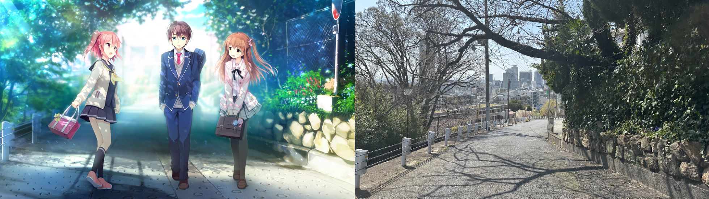
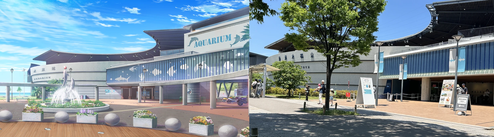

## 前言
- 本文为笔者在 2024.4.1 于日本神户市关于Galgame『恋×シンアイ彼女』的圣地巡礼记录。
- 圣地巡礼系列文章仅供学习交流，本文所引用的Cg截图版权归属Us:track

## 正文

『恋×シンアイ彼女』（以下简称恋彼女）对我来说是一部意义非凡的作品，可以说是将我拉入Galgame坑的启蒙作之一。在本作中我认识了之后最喜欢的脚本家之一的新岛夕老师，最喜欢的配乐之一的水月陵老师，当然让这部作品能进入我视线并有兴趣推的君岛青及しらたま白玉的原画也发挥也非常出色。

不过距离一周目推本作已经过去了接近8年了，剧情实在是忘记了很多，因此本文就主要讲一些圣地巡礼的见闻，原作内容就不展开讲了。

4.1这天日本的樱花还未到满开时分，不过在京都神户街上的某些个不引人注意的角落，已经有一两株盛开着的樱花树了。晚春的天气非常宜人，太阳高悬却几乎感觉不到炎热，这样的日子最适合出门游玩了。不过虽然这么说，神户市和我居住的京都市其实也只隔着一个大阪，坐JR一个小时的车程就到了。

### 通学路

这次巡礼首先来到的是洸太郎、姬野以及彩音的通学路。

按照游戏里设定来看，这里应该处于主角们上学的校门前。现实里的这条路通向一家婚庆公司，虽说没有保安似乎可以自由进出的样子，但考虑到只是拍拍照就不便进去了。所幸站在门口的角度已经非常还原，从这里也可以远眺神户市的街景，视野还是很开阔的。

游戏里的这张Cg第一次出现应该是洸太郎三人，尤其是姬野和彩音刚认识，互相给对方取昵称的时候。

### 御影駅

然后就是御影駅，这里是星奏和洸太郎约会碰面地点，也是非常还原的一处背景。

###　神户水族馆

###　须磨海岸

## 写在最后

