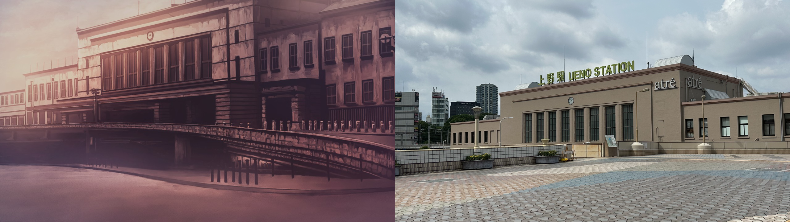
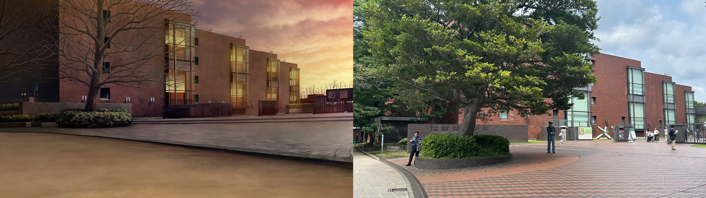
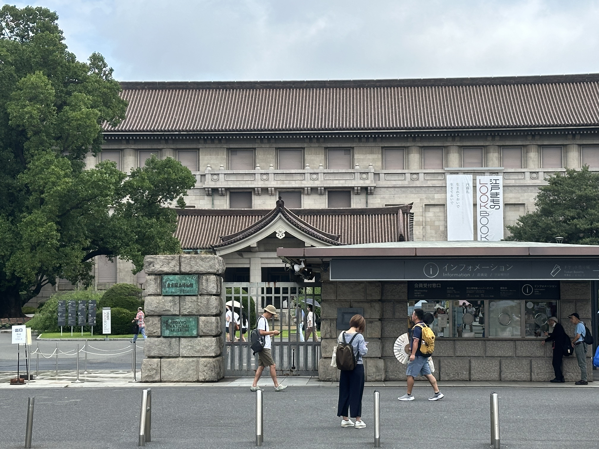
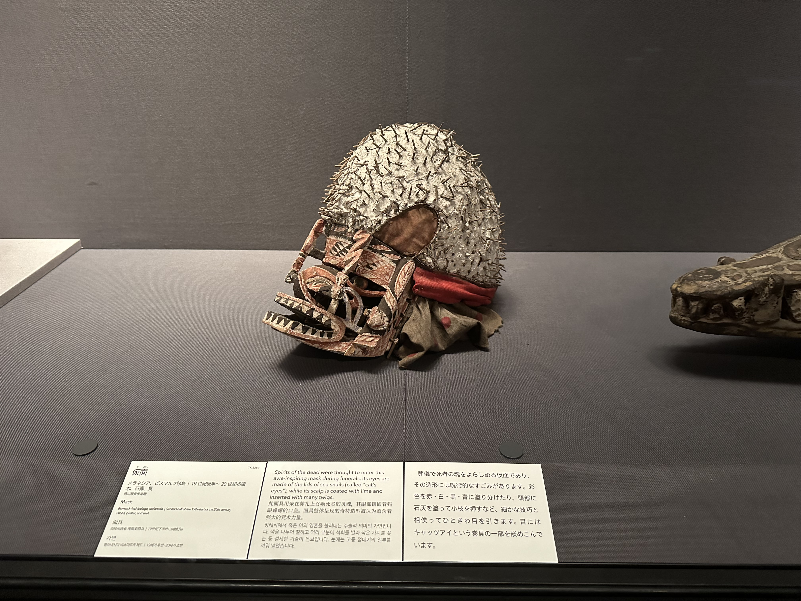
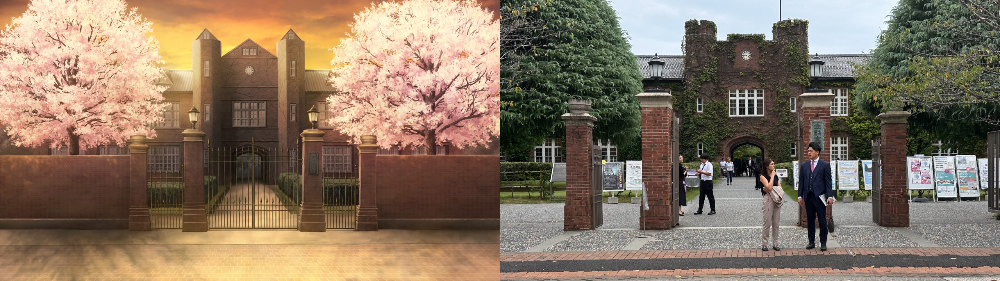
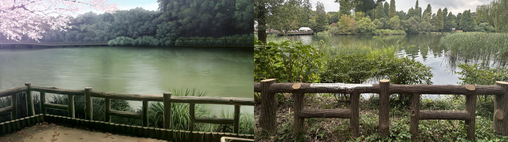
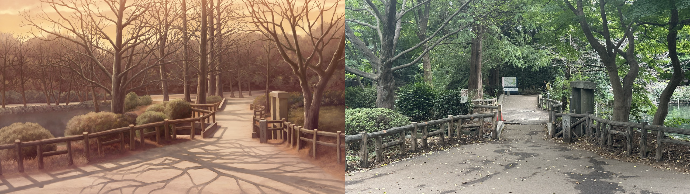

## 前言
- 本文为笔者在 2024.9.28 于日本东京都关于Galgame『殻ノ少女』的圣地巡礼记录文章，内容更偏向个人的旅行见闻而非巡礼攻略，如有需要参照地点巡礼可以直接看各节带数字编号的小标题配合谷歌地图搜索。
- 小标题采用 现实地点名（作品中地点名）的形式，图片下方也会有注释。
- 圣地巡礼系列文章仅供学习交流，本文所引用的游戏CG版权归属 Innocent Grey。

## 正文

### 上野駅
游戏里的上野站也即是现实中的东京台东区的上野駅，从上野駅出站就是比较知名的旅游景点上野公园了。这里有东京国立博物馆、东京都美术馆、上野恩赐动物园、不忍池弁天堂等可以参观，似乎还有定期的昆虫展，以及我去了两次都碰上了的公园中心举办的活动。

总之对于一般游客来说也是个很不错的去处。其中博物馆我进去参观过，分为了东洋馆、西洋馆，能感受各个国家的历史，中国的书法绘画出土的文物也不少，很值得一去。

『殻ノ少女』中的上野站虽然细节上有些差异，不过很明显能看出今天上野站的样子。

### 东京都立美术馆

位于上野恩赐公园内部，『殻ノ少女』游戏中是史黛拉ステラ 的固定刷新点，不过这里我本人就没进去参观过了。

相对地，放两张之前去东京国立博物馆的照片吧，美术馆之后有机会去参观吧。

### 立教大学

『殻ノ少女』樱羽女学院对应现实中的立教大学，从池袋站下车步行10分钟左右就能到达。从这个欧式建筑风格也能看出来私立大学的气息，不过和游戏不同并不是女校。个人感觉这个爬满绿植的主楼比游戏还要好看些，不知道立教大学里种的是不是樱花树呢？ 

### 井之头公园

从吉祥寺站下车步行12分钟的距离能到这个公园。

虽说位于新宿以西东京都的外围，但这里的人还是很多，井之头公园内有很多国内已经几乎不怎么能看到的娱乐设施和项目，像是在家长陪同孩子一起在湖心划船，很多小朋友围在一起看一个老爷爷表演，不禁让我感到有些怀念。

当然也是由于人太多，湖边的长凳坐满了人，母亲和孩子，男女情侣什么的，实在是不太好意思麻烦他们起身让我拍张照片，所以只好妥协找了一个别的角度，姑且是远处的横桥、左侧伸出的树枝以及前方的木栅栏都有拍到。

这里其实就是和冬子见面的地方

另一处也是位于公园内，游戏里选择地点时的缩略图——井之头公园的林中池塘附近，这里环境还是很不错的，适合散散步什么的。

#### 写在最后

——2024.9.28 日本东京都 

这次由于是Galgame的巡礼，内容不是很多，同时位于冈山倉敷的美术馆也由于在很远很远的日本中国地区的广岛附近，所以也只能遗憾放弃这个场景（以后有机会去那里旅游一定补上

另外巡礼当天行程比较紧，也没有在景点好好游玩，因此也没法写景点的见闻（当然上野公园还是真的推荐来日本旅游的朋友去的，尤其是博物馆）

『殻ノ少女』虽是今年才推的Galgame，不过考虑到偏悬疑向就不在文章里写感想了，虽然短不过就当单纯图片向巡礼记录了。

那么最后依然是感谢每个读到这里的你。