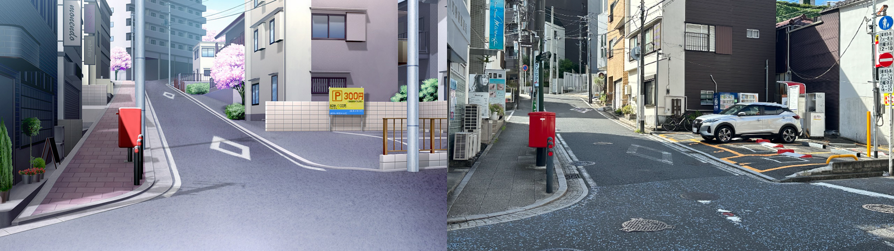
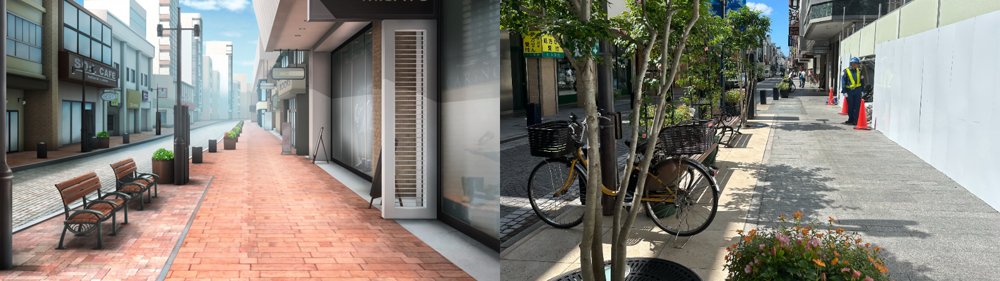
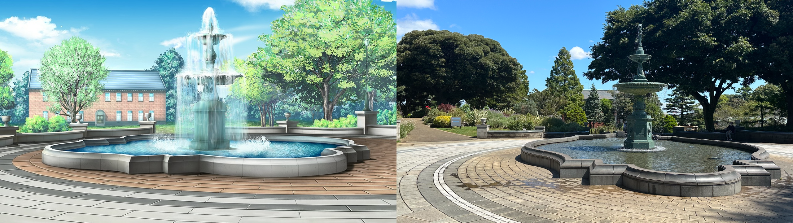
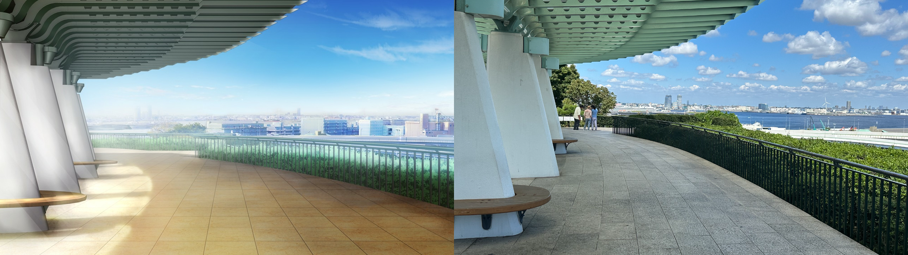
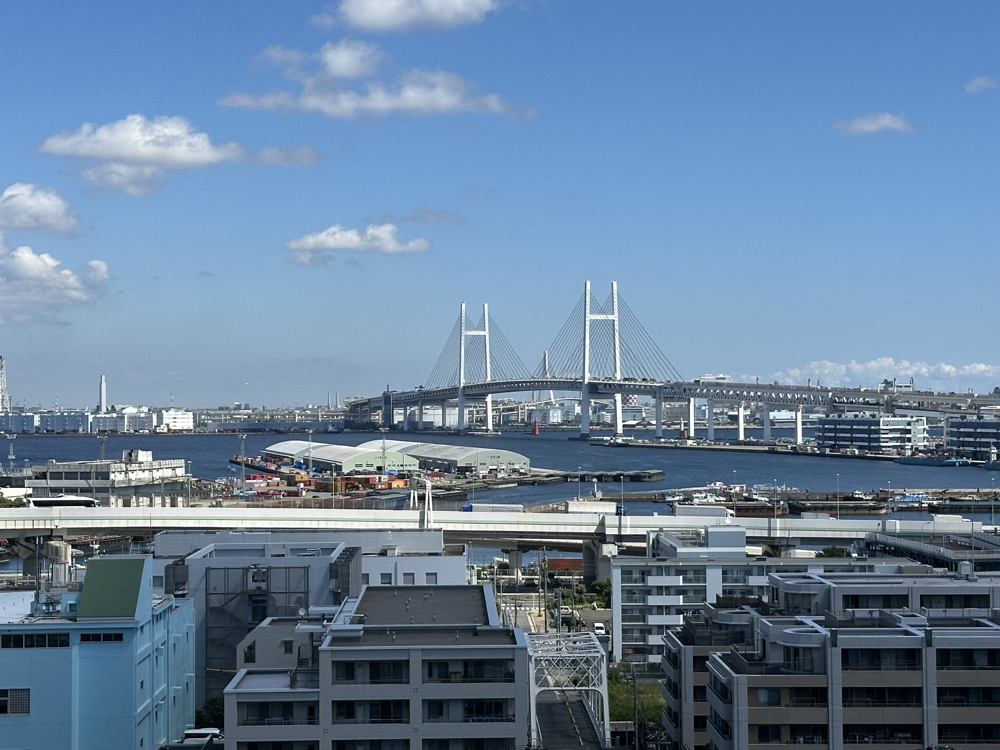
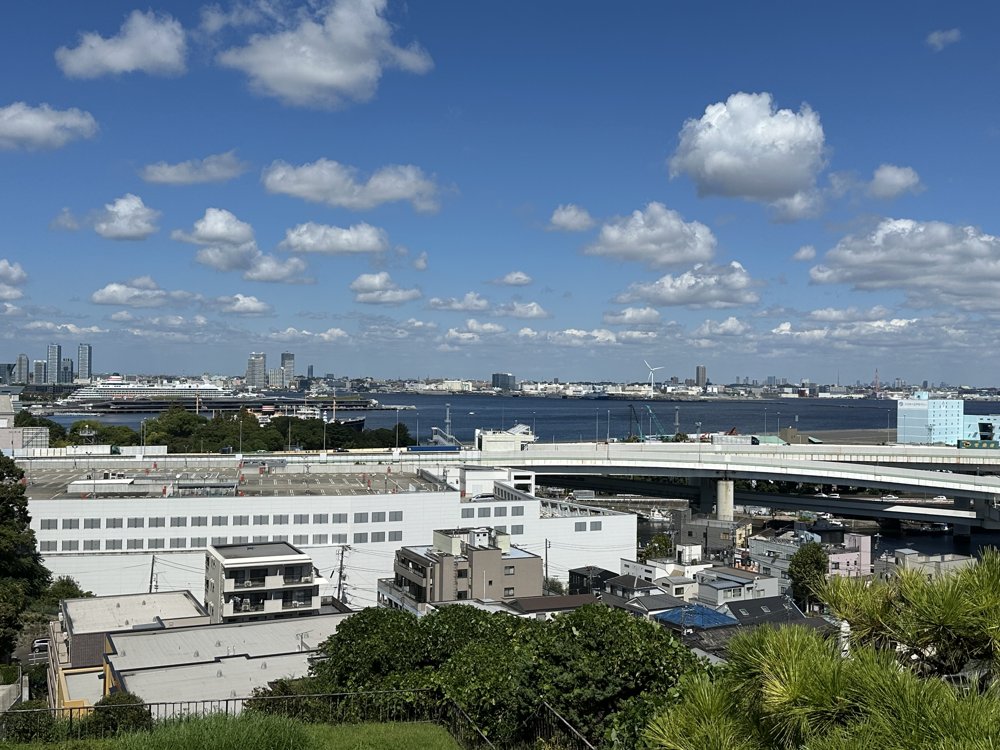
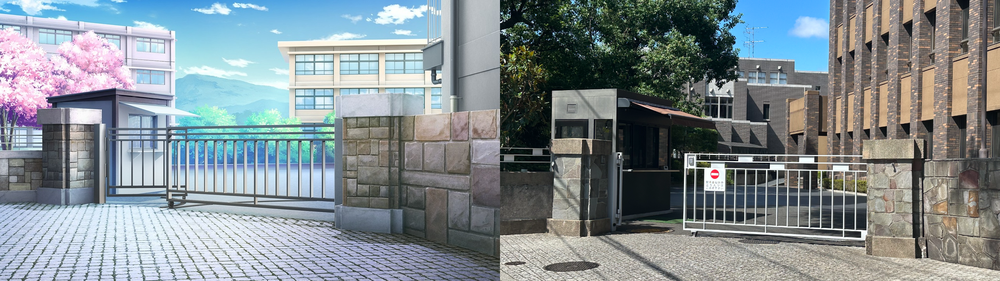
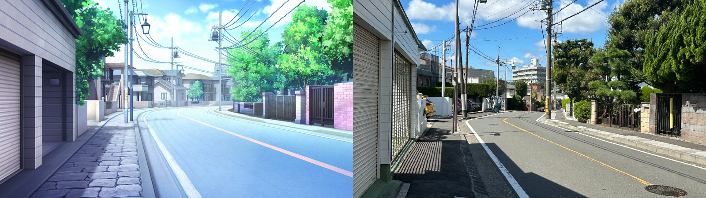
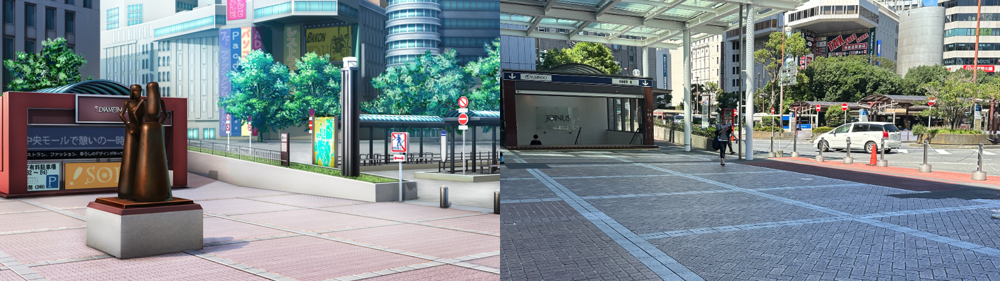
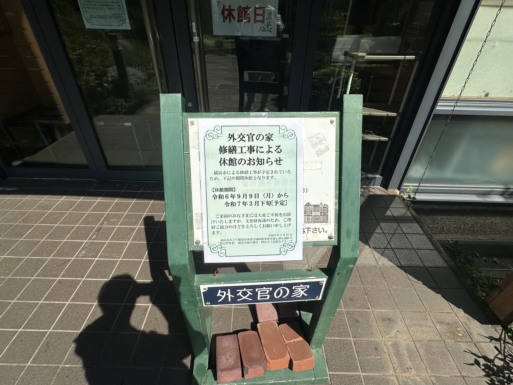

## 前言

- 本文为笔者在 2024.9.13 于日本神奈川县横滨市关于Galgame『Clover Days』的（不完整版）圣地巡礼记录文章，内容更偏向个人的旅行见闻而非巡礼攻略，如有需要参照地点巡礼可以直接看各节带数字编号的小标题配合谷歌地图搜索。
- 圣地巡礼系列文章仅供学习交流，本文所引用的游戏CG版权归属 ALcot 。

## 正文

『Clover Days』应该是我入坑Galgame最开始玩的废萌作，如果要评价一下的话，我觉得在废萌里算是最优秀的一批了，剧情温馨治愈但一点也不白开水，基本的矛盾冲突描写到位，人物塑造上贡献了萌系作品里最成功的妹妹角色之一的杏玲，很值得一玩。事实上这也确实是蜂巢最成功的作品之一，巅峰期仁村老师的原画简直无敌（求求你回来画Gal吧，别惦记你那b手游了

那么下面是正式的巡礼对比图

### 石川町駅前郵便局

很还原的一处场景Scene，和游戏里几乎一摸一样，从石川駅出站步行5分钟就能到。

这里也是游戏里的通学路，鹰仓杏玲线里表白的地方（当年截的图现在还存在手机里

### 元町商店街

位于横滨的元町商店街，同样可以从石川駅出站步行10分钟左右到的地方。

虽然道路两旁种了树，右边的店铺也在装修，但从横椅和挂牌可以看出来就是这里了。

### 港の見える丘公園 噴水広場

横滨市内的一处观光场所，里面有横滨市英国馆、大佛次郎纪念馆、神奈川近代文学馆等，欧式建筑很美，让我想到了之前神户去的异国文化馆，感觉还是很有参观价值的。

喷水广场就位于港の見える丘公園的正门，走进去就能看到，远处的红色房屋被树木遮住了。

游戏里的这个场景根据设定没记错的话似乎是出现在杏玲帮忙的教会，很符合这里整体欧式的建筑风格的基调。

也就是这里（这套洋装真好看

### 港の見える丘公園 展望台

港の見える丘公園里的展望台，地势较高，能感受到来自东京湾的海风，非常舒服。

### フェリス女学院中学校・高等学校

主人公们就读的学校

![[IMG_0557.jpeg]]

### 山手町コーポラス

游戏里的放学路，现实中确实也在学校的附近，右边的围墙栅栏里就是フェリス女学院了。

### JR横浜駅 西口

在横滨站反复转了一圈没找到图中的雕像，但是远处的建筑和巴士站能看出明显就是这里，所以大概也许可能是拆掉了吧。

### 外交官の家

很遗憾目前处于维护当中，一直持续到明年的3月，如果有要来的朋友可以注意一下时间。

这里是原作游戏中鹰仓家宅邸的取景地，根据日本同好的巡礼文章里面的陈设和游戏cg可以说完全一致，总之之后有机会来的话再补齐吧。

## 写在最后

——2024.9.13

感谢每个读到这里的你

ALcot的作品我只玩过少数几作，『Clover Day’s』就是其中的巅峰了。之后的作品剧情暂且不论，绘柄有时都不太稳。也难怪打赢复活赛的20周年纪念众筹作『Clover Memory‘s』连人设都和本作相似度极高，也是久违地看到了仁村老师的Galgame原画，虽然只是sub，也是希望这作能卖的好点吧

